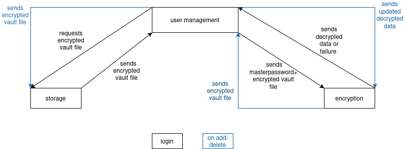

## Architecture

## Threat Model

### Master Password

| Threat | CIA Property | Mitigation |
|---|---|---|
| Master password is echoed to the screen while being typed, allowing shoulder surfing | Confidentiality | Disable terminal echo during password entry |
| Master password is passed as a command-line argument, ending up in shell history and visible to other local users | Confidentiality | Never accept the master password as a CLI argument; always prompt for it interactively |
| Weak or guessable master password is vulnerable to brute-force or dictionary attack | Confidentiality | Derive the encryption key from the master password using Argon2id with a high cost factor (time and memory cost), making each guess computationally expensive |

### Vault at Rest

| Threat | CIA Property | Mitigation |
|---|---|---|
| Vault file is readable by other local users on the same machine | Confidentiality | Restrict file permissions to the owner only when the vault is created |
| Vault file contents are modified directly on disk (e.g. via a hex editor or by restoring an old backup) | Integrity | Use an AEAD cipher; the authentication tag causes decryption to fail if any byte has been altered |
| Vault file is deleted, or left truncated/corrupted due to an interrupted write (crash, disk full mid-save) | Availability | Write to a temporary file first, then atomically rename it over the vault file; keep a backup copy |
| Vault path is replaced with a symlink to another file before the program opens it | Confidentiality / Integrity | Verify the path is a regular file, not a symlink, before opening; create the vault directory with restrictive permissions |
| Nonce is reused across multiple encryptions with the same key | Confidentiality | Generate a fresh, cryptographically random nonce for every encryption operation |

### Vault in Memory

| Threat | CIA Property | Mitigation |
|---|---|---|
| Derived encryption key and decrypted vault contents sit as plaintext in RAM and could be swapped to disk or read via a debugger/core dump | Confidentiality | Allocate sensitive buffers with `sodium_malloc`/`sodium_mlock` (locked, non-swappable memory); securely wipe with `sodium_memzero` immediately after use |
| Session key is kept in memory for the entire session (for usability, so the master password is not re-entered for every operation), extending the window in which it could be exposed | Confidentiality | Trade-off accepted deliberately for usability; mitigated by zeroing all sensitive memory on logout/exit, as above |
| Password displayed via get remains visible in terminal scrollback indefinitely | Confidentiality | copy to clipboard instead of printing; clear clipboard automatically after a short timeout |
### Interface

| Threat | CIA Property | Mitigation |
|---|---|---|
| Error messages distinguish between "wrong master password" and "corrupted/tampered vault," giving an attacker information about which is the case | Confidentiality | Always return a single generic error message (e.g. "authentication failed") regardless of the actual underlying cause |

## Initial Design Decision
### Vault Format
The vault is stored as a single binary file with the following layout: a magic-bytes-and-version header, which lets the program recognize its own file format and reject an invalid or corrupted file before attempting any cryptographic operation; the salt, used to re-derive the same Argon2id key on every subsequent unlock; the nonce, generated fresh on every write and required by AES-256-GCM to decrypt correctly; and finally the ciphertext together with its authentication tag, which together represent the encrypted vault contents.
### Cryptographic Scheme
Argon2id derives a 256-bit key from the master password and a stored salt. That key, together with a freshly generated nonce, encrypts the vault contents using AES-256-GCM, producing ciphertext and an authentication tag.